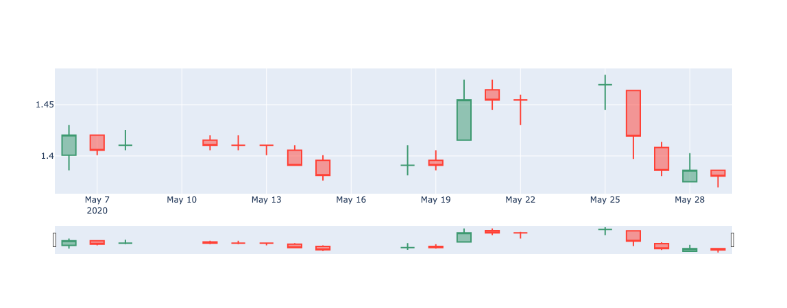
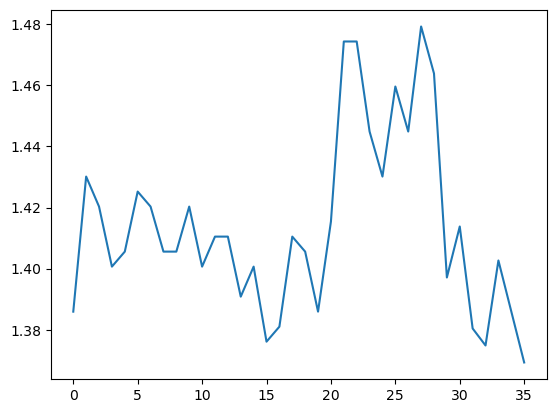
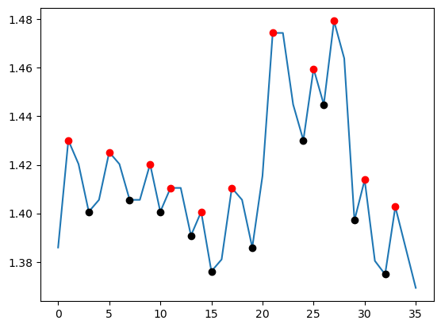

# Strategic Stock Trading Using Machine Learning

Quantitative methods have been widely adopted in financial market, which relies heavily on mathematical and statistical models to make investment decisions. The key aspects of the quantitative trading industry include: 
1. Data Analysis
2. Algorithm Development 
3. Risk Management 
4. High Frequency Trading 
5. Machine learning

just to name a few. 

The main focus in this project will be concentrated on the application of machine learning models for stock trading. Adopting a simple philosophy- buy low, sell high. The mathematical meaning of low points and high points in any market are essentially local extrema. By identifying the characteristics of these extrema to determine what is the right time to engage in the market and the timing to avoid. To breakdown it down, this could be simply put into a binary classification problem. Here, Logistic Regression, a most commonly seen machine learning model, is adopted to provide a benchmark analyzation of real-life stock data that are actively trading in the market. This include data acquisition, data pre-preprocessing, modeling and training, and evaluation. Some examples of reliable data resources include and not limited to [Yahoo Finance](https://finance.yahoo.com/), [Nasdaq](https://www.nasdaq.com/market-activity/quotes/historical), [Microsoft Qlib API](https://github.com/microsoft/qlib/tree/main), and [TD Ameritrade API](https://developer.tdameritrade.com/apis). The raw data is obviously not labeled, yet, for supervised learning, it is necessary to provide labeled data for the machine to learn. Here, the idea is to adapt `scipy.signal.find_peaks` package to locate all local extrema and extract and label them as ground truth. The extracted extrema are then feed to the Logistic Regression model and evaluated using confusion matrix. Additionally, a backtest can be conducted to assess the model's performance and determine the binary classification threshold based on the revenue generated by the current strategy.

### Example of Stock Data Acquisition and Labeling Extrema

#### 1 month data

#### Convert to continuous time series

#### Labeling extrema

